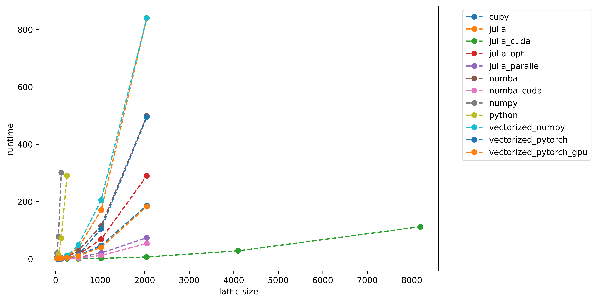
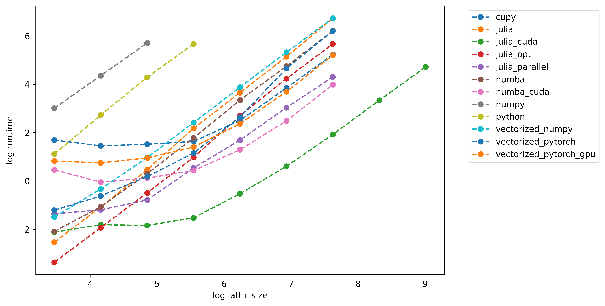

# HighPerformance-GameDynamics

> **Accelerating evolutionary multi-agent simulations using High-Performance Computing (HPC)**

HighPerformance-GameDynamics demonstrates how modern High-Performance Computing (HPC) techniques can dramatically accelerate large-scale evolutionary game simulations. The repository implements the same **Voluntary Public Goods Game (VPGG)** using multiple programming languages, optimization strategies, and hardware architectures while preserving the underlying simulation model.

The objective is not only to provide a fast implementation, but also to demonstrate the contribution of each optimization technique—from simple algorithmic improvements to GPU and distributed computing.

This repository is intended for researchers, students, and developers working on evolutionary game theory, agent-based modeling, computational social science, or scientific computing who would like to understand how HPC techniques improve simulation performance.

---

# Why HPC?

Agent-based simulations are computationally expensive because every generation requires millions of interactions between neighboring agents. Researchers often need to

* increase the lattice size,
* simulate more generations,
* perform parameter sweeps,
* repeat experiments many times,
* explore different update rules.

As simulations grow, runtime becomes the primary bottleneck.

Instead of changing the game itself, this project investigates how different computational techniques reduce execution time while producing the same simulation.

---

# Optimization Journey

This repository follows the typical optimization path used in scientific computing.

```text
Pure Python
      │
      ▼
NumPy Vectorization
      │
      ▼
JIT Compilation (Numba)
      │
      ▼
Julia Implementation
      │
      ▼
Algorithmic Optimization
      │
      ▼
Multi-threading
      │
      ▼
GPU Computing
      │
      ▼
Distributed Computing
```

Each implementation introduces one or more HPC techniques while preserving the same game dynamics.

---

# HPC Techniques

| Technique                | Purpose                                                |
| ------------------------ | ------------------------------------------------------ |
| Algorithmic Optimization | Reduce unnecessary computations and memory allocations |
| Vectorization            | Replace Python loops with array operations             |
| JIT Compilation          | Compile performance-critical code                      |
| Multi-threading          | Utilize all CPU cores                                  |
| GPU Computing            | Execute massively parallel workloads                   |
| Distributed Computing    | Scale simulations across multiple machines             |

---

# Implementations

| Implementation    | Language | Execution Model       | CPU | GPU |
| ----------------- | -------- | --------------------- | --- | --- |
| Pure Python       | Python   | Sequential            | ✓   | ✗   |
| NumPy             | Python   | Sequential Vectorized | ✓   | ✗   |
| Vectorized NumPy  | Python   | Fully Vectorized      | ✓   | ✗   |
| PyTorch CPU       | Python   | Tensor Operations     | ✓   | ✗   |
| PyTorch CUDA      | Python   | GPU Tensor Operations | ✗   | ✓   |
| CuPy              | Python   | CUDA Arrays           | ✗   | ✓   |
| Numba CPU         | Python   | JIT + Parallel        | ✓   | ✗   |
| Numba CUDA        | Python   | CUDA Kernel           | ✗   | ✓   |
| Julia             | Julia    | Sequential            | ✓   | ✗   |
| Julia Optimized   | Julia    | Optimized Sequential  | ✓   | ✗   |
| Julia Parallel    | Julia    | Multi-threaded        | ✓   | ✗   |
| Julia Distributed | Julia    | Distributed Computing | ✓   | ✓   |
| Julia CUDA        | Julia    | CUDA                  | ✗   | ✓   |

---

# Installation

## Python

```bash
pip install numpy pandas numba cupy torch matplotlib dask
```

## Julia

```julia
using Pkg

Pkg.add([
    "CUDA",
    "BenchmarkTools",
    "CSV",
    "DataFrames",
    "Distributed",
])
```

---

# Benchmarking

All benchmarks execute the **same simulation** using identical parameters.

Only the implementation changes.

Benchmark parameters include

* lattice size
* multiplication factor
* number of generations
* random initialization
* update rule

This ensures that runtime comparisons are fair.

---

# Benchmark Environment

| Component | Specification      |
| --------- | ------------------ |
| CPU       | AMD Ryzen 5 7640HS |
| CPU Cores | 6                  |
| Threads   | 12                 |
| RAM       | 32 GB              |
| GPU       | NVIDIA L4          |
| Python    | 3.13               |
| Julia     | 1.12               |
| CUDA      | 12.x               |

---

# Runtime Comparison

Example benchmark for **L = 128**

| Implementation   | Runtime (s) | Speedup |
| ---------------- | ----------: | ------: |
| Python           |       72.56 |      1× |
| NumPy            |      300.87 |    0.2× |
| Vectorized NumPy |        2.63 |   27.6× |
| PyTorch          |        1.20 |   60.6× |
| Numba            |        1.35 |   53.7× |
| Julia            |        1.59 |   45.6× |
| Julia Parallel   |        0.46 |  159.4× |
| CuPy             |        4.56 |   15.9× |
| PyTorch CUDA     |        2.59 |   28.0× |
| Numba CUDA       |        1.12 |   64.5× |
| Julia CUDA       |        0.16 |  457.3× |

---

# Parallel Scaling

Julia multithreading benchmark.

| Threads | Runtime (s) | Speedup | Efficiency |
| ------- | ----------: | ------: | ---------: |
| 1       |       77.60 |     1.0 |       1.00 |
| 2       |       44.97 |    1.73 |       0.86 |
| 4       |       27.14 |    2.86 |       0.71 |
| 8       |       20.45 |    3.79 |       0.47 |

---

# Results

## Runtime versus Lattice Size

The figure below compares execution time as the lattice size increases. Although all implementations have similar computational complexity, HPC techniques significantly reduce the constant execution cost.

<p align="center">

</p>

---

## Log–Log Runtime Scaling

The log–log plot illustrates how execution time scales with problem size while highlighting the performance improvements achieved through optimization.

<p align="center">

</p>

---

# Key Results

* More than **450× speedup** compared with the baseline Python implementation.
* Demonstrates the impact of vectorization, JIT compilation, multithreading, GPU acceleration, and distributed computing.
* All implementations simulate the same evolutionary game, enabling direct performance comparisons.
* Provides a reproducible benchmark framework for evaluating HPC techniques on agent-based simulations.

---
